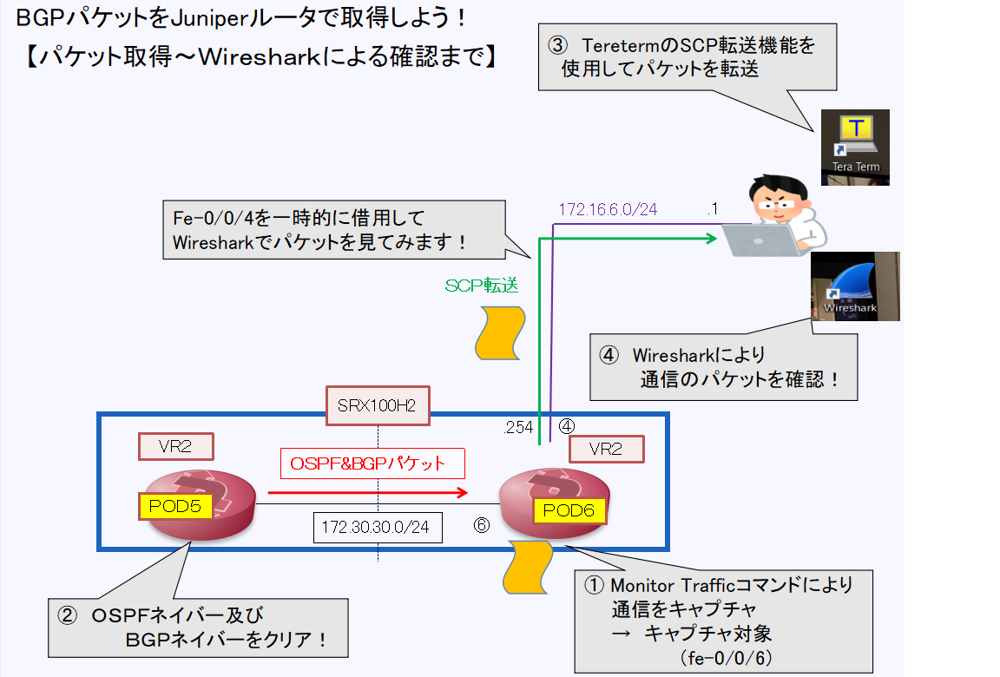
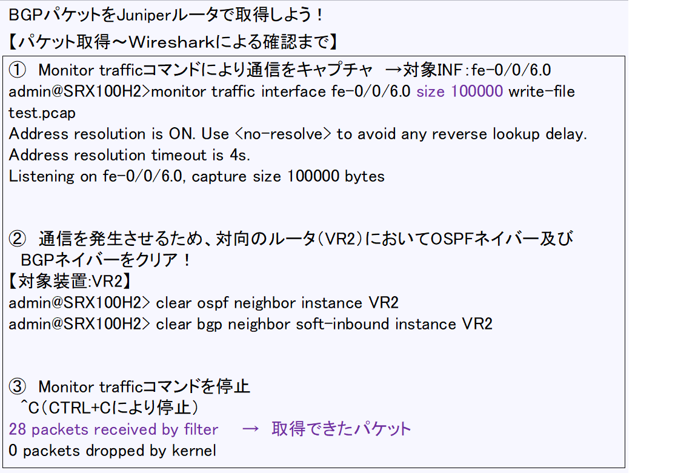
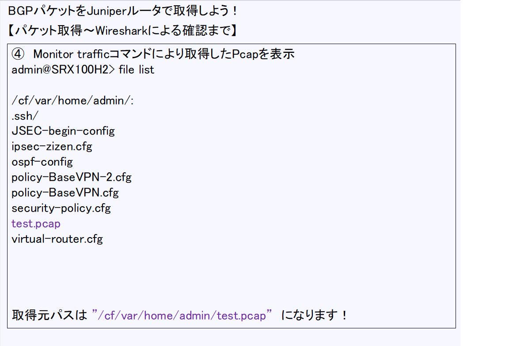
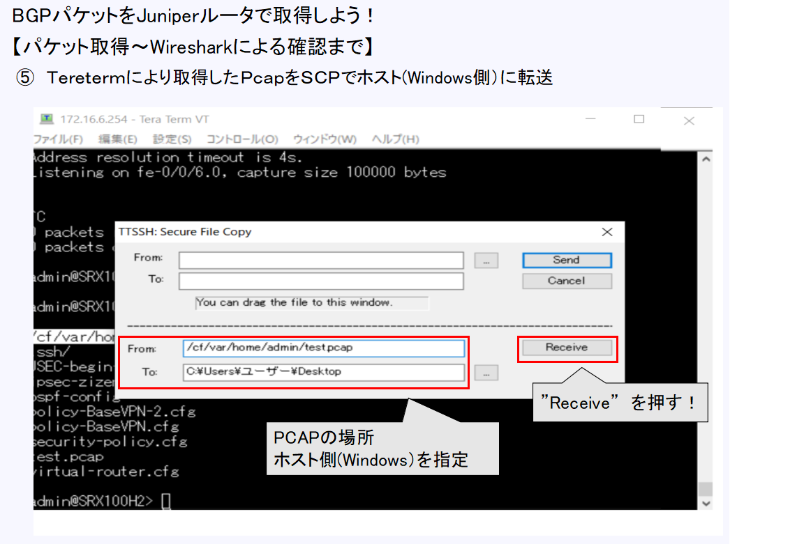
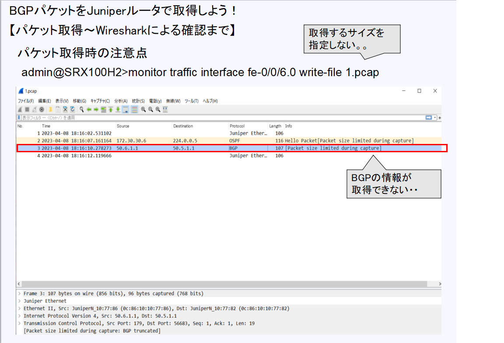
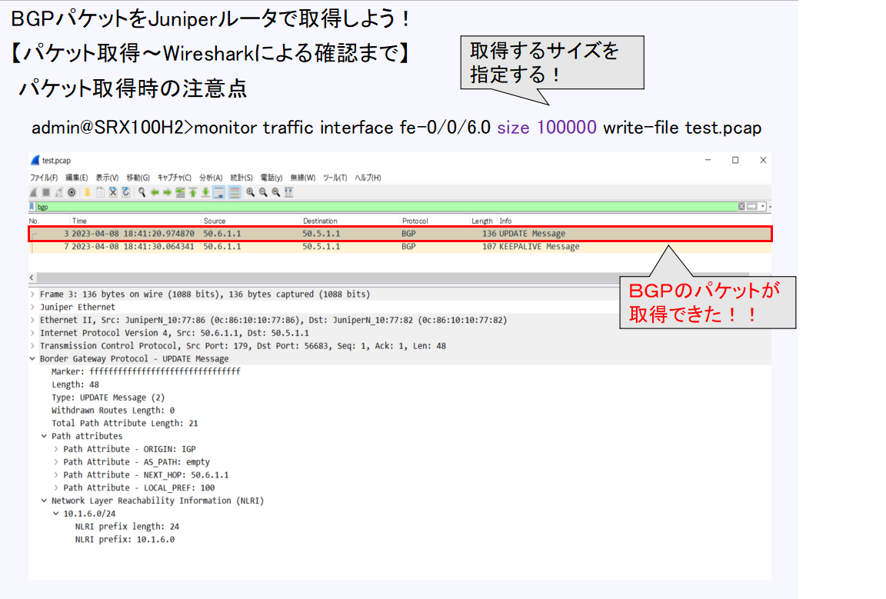

[目次に戻る](./Junos-BGP-exercises.md)  

# BGPパケットをJuniperで取得してみよう
Junosにおいてパケットキャプチャを実施する方法はいくつかあります。 

ネットワーク管理と監視ガイド 
https://www.juniper.net/documentation/jp/ja/software/junos/network-mgmt/topics/topic-map/analyze-network-traffic-by-using-packet-capture.html 

今回はmonitor traffic コマンドを入力して、junosのインタフェース間で伝送されるパケットを取得してみます 

## 今回の取得イメージ 
 

##取得要領 
 

 

 

 

##パケット取得の注意点 
パケットを取得する際はサイズ指定するようにしましょう！ 

□取得できていない場合 
 
□取得できた場合 
 

