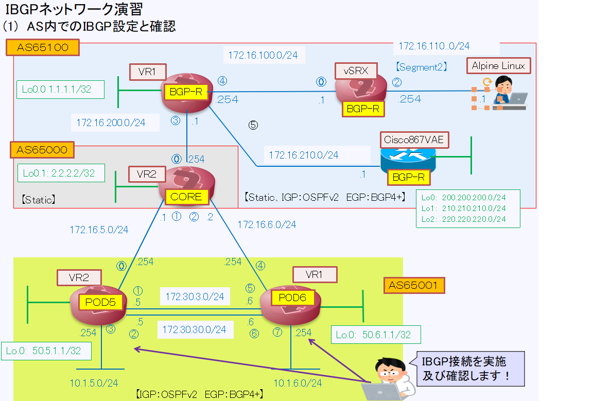

[目次に戻る](./Junos-BGP-exercises.md)  

# IBGPによるネットワーク演習

**【IBGPを設定します】** 
   

## 実習内容 
### １　AS内で動作するIGPとしてOSPFを設定します。
【VR1】
　#set routing-instances VR1 protocols ospf area 0 interface fe-0/0/5.0 
　#set routing-instances VR1 protocols ospf area 0 interface fe-0/0/6.0 
　#set routing-instances VR1 protocols ospf area 0 interface fe-0/0/7.0 
　#set routing-instances VR1 protocols ospf area 0 interface lo0.1 

　設定後、OSPFの確認を実施します 
　　>show ospf neighbor instance VR1 
　  > show ospf database instance VR1 
　  > show route protocol ospf 

### 2 IBGPの設定を実施します(ASは65000）
#set routing-instances VR1 routing-options autonomous-system 65001 
#set routing-instances VR1 protocols bgp group INTERNAL peer-as 65001 
#set routing-instances VR1 protocols bgp group INTERNAL type internal 
#set routing-instances VR1 protocols bgp group INTERNAL neighbor 50.5.1.1 
#set routing-instances VR1 protocols bgp group INTERNAL local-address 50.6.1.1 

### 3 設定後、対向のルータ（VR2）とピアが張れていることを確認します
　> show bgp summary 
　　Groups: 2 Peers: 2 Down peers: 0 
　　Peer                     AS      InPkt     OutPkt    OutQ   Flaps Last Up/Dwn State|#Active/Received/Accepted/Damped...  
　　　50.5.1.1              65001        657        657       0       0     4:53:23 Establ 
　　　　VR1.inet.0: 0/1/1/0 
　　　50.6.1.1              65001        656        657       0       0     4:53:23 Establ 
　　　　VR2.inet.0: 0/1/1/0 

### 4 ピアが張れていますが、経路情報は送受信されていないことを確認します
> show bgp neighbor instance VR1 
       .
        .
    Received prefixes:            0　　　　　　　　　　　→　経路受信もなし 
    
    Advertised prefixes:          0　　　　　　　　　　　→　経路送信もなし 

 
>show route receive-protocol bgp 50.6.1.1 

inet.0: 1 destinations, 1 routes (1 active, 0 holddown, 0 hidden) 

VR1.inet.0: 11 destinations, 11 routes (11 active, 0 holddown, 0 hidden) 

VR2.inet.0: 11 destinations, 11 routes (11 active, 0 holddown, 0 hidden) 

  

