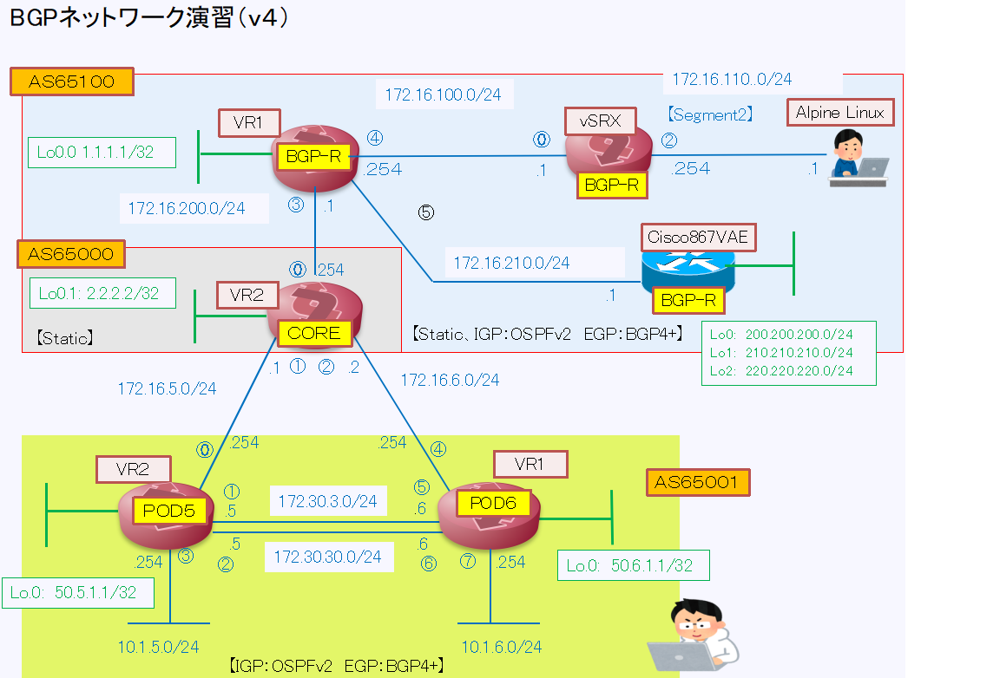
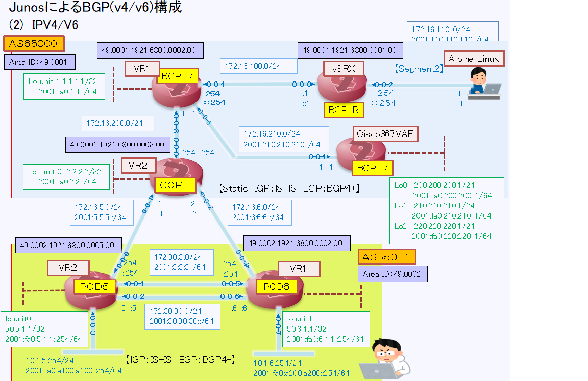

# JuniperにおけるBGPネットワーク演習

## 本資料は
Juniperネットワーク社のJunosを使用したBGPネットワーク演習資料になります 
（Juniperネットワークス社の公式資料ではありません。。 
　　　　　　　　　　　　私自身が受講した講習及び自宅で検証した内容を元に作成しています） 

## 使用した器材
juniper SRX100×３台 
juniper vSRX(Ver22）×１台 
Cisco867VAE　×１台 
       
## 内容 
〇　環境準備：　[次のチャプターへ進む](./preparation.md)  

 **1 BGPネットワーク演習(IPv4)**
 
 (1) AS内でのIBGP設定と確認：　[次のチャプターへ進む](./IBGP-exercies.md)  
 (2) AS外へのEBGP設定と確認：　[次のチャプターへ進む](./EBGP-exercies.md)  
 (3) NEXT-HOP属性変更による確認：　[次のチャプターへ進む](./NEXT-HOP-exercies.md)  
 (4) Local Preference値属性変更による確認　[次のチャプターへ進む](./LocalPreference-exercies.md)  
 (5) MED値属性変更による確認　[次のチャプターへ進む](./MED-exercies.md)  
 (6) AS_Pathによるフィルタリング設定と確認　[次のチャプターへ進む](./AS_Path-filter-exercies.md)  
 (7) community属性の使用及び確認　[次のチャプターへ進む](./AS_Path-filter-exercies.md)  
 (8) BGPルートリフレクターの設定と確認[次のチャプターへ進む](./BGP-route-refrecter.md)   

 **【BGPネットワーク演習(V4）のトポロジー】** 
   

**2 BGPネットワーク演習(IPv4/IPv6)**

　(1) AS内でのIBGP設定(IS-IS設定）と確認：　[次のチャプターへ進む](./IBGP-exercies-IS-IS.md)  

 **【BGPネットワーク演習(V4/V6）のトポロジー】** 
   

**3 参考：BGPパケットをJuniperルータで取得しよう！**
 [次のチャプターへ進む](./BGP-Packet-capture.md)  

## 参考資料
  [Junos　BGPユーザガイド](https://www.juniper.net/documentation/jp/ja/software/junos/bgp/topics/topic-map/bgp-overview.html) 
  [Junos BGP Routing](https://www.infraexpert.com/infra/study04.html) 
   

## その他　
  　完成までしばらくかかります・・・内容は逐一加筆/修正します 　　
 
 　本内容は私の自宅Lab機材で実施した内容を元に作成しています。 
   
   個人的にJuniperSRXを自宅で触っている一市民です(Juniperネットワーク関係者でもありません）  
  　実際の設定においては事前に検証等を実施してください 　

  
