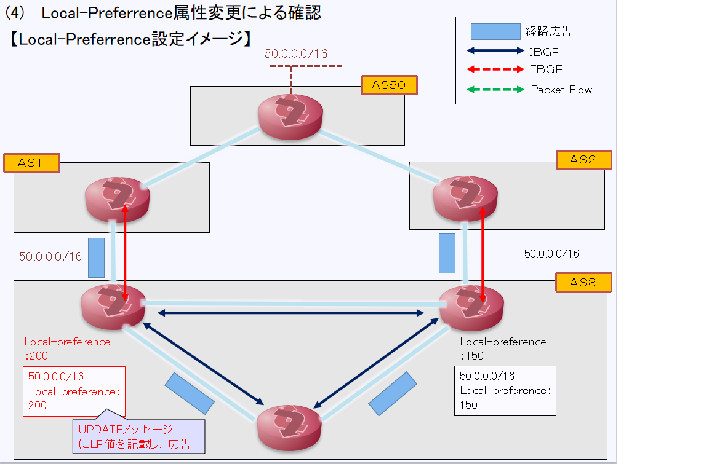
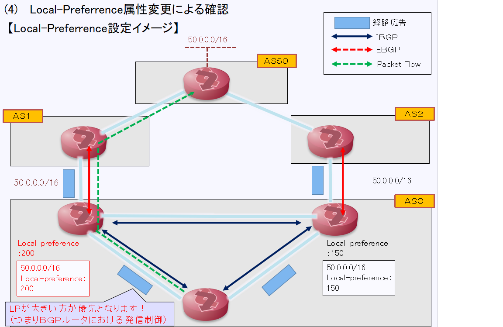
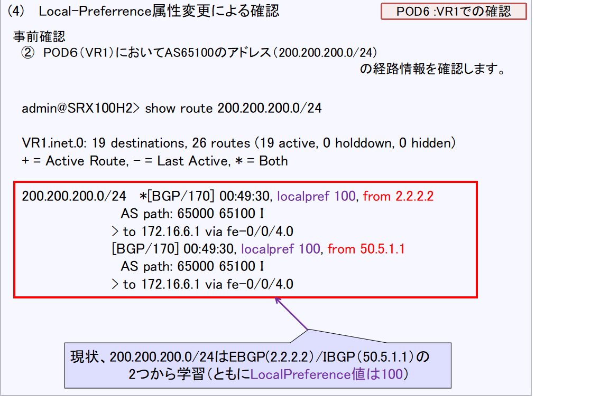
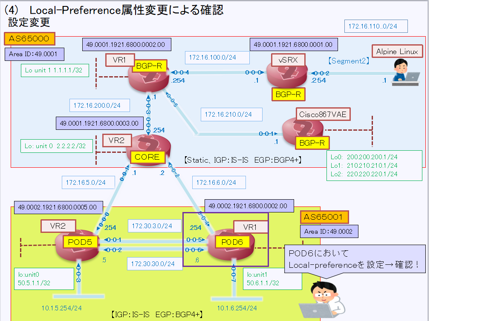
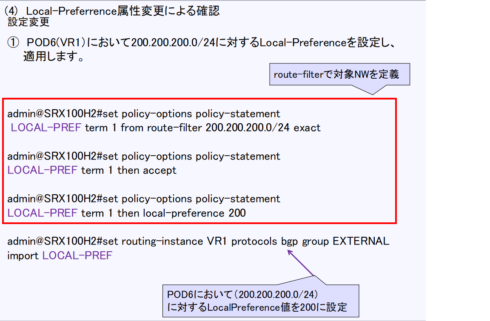

[目次に戻る](./Junos-BGP-exercises.md)  

# Local-Preferrence属性変更による確認
## Local-Preferrence属性とは？？
LOCAL_PREFアトリビュートは、内部ASのIBGPネイバールータに対し、 
外部ASに存在するネットワーク宛のトラフィックへの発信元を示すアトリビュート 
です。 
このアトリビュートはLOCAL_PREFENCEとも呼ばれておりAS内でのローカル優先度を示します 

またLOCAL_PREF値はIBGPピアにのみ伝達されて、EBGPピアには伝達されません 
（LOCAL_PREF値は自分自身のBGPルータに対し適用される値） 
文字通り、宛先ネットワークへのネクストホップのIPアドレスを示すアトリビュートです 

### Local-Preferrence属性設定イメージ
　
　次のスライドで動作を説明します
   
  
  自身のAS(AS3）からAS50に存在するネットワーク(50.0.0.0/16）に通信する状況です 
  AS3はAS50向けの経路として異なる２つのAS(AS1/AS2）と接続されています 
  今回AS3からAS50向けの経路としてAS1を指定したい場合、上記のようにIBGP設定においてLocal-Preferrenceを設定します 
  図のように 
  　AS1向けルータにはLocal-Preferrence：200 
  　AS2向けルータにはLocal-Preferrence：150 
  
  Local-Preferrenceは値の大きい方を優先しますので 
  次のスライドのように実際の通信はAS1経由でトラヒックが転送されます 
  
   
  
  
### Local-Preferrence属性変更の設定と確認
  （実施手順） 
  【事前確認】 
   ①　AS65100のCiscoルータが保有するサブネットをBGPで学習するように設定追加を実施します 

   ②　各PODにおいてAS65100のアドレス（200.200.200.0/24)の経路情報を確認します 
　　　【先に設定したNEXT-HOP属性の変更はしたままで大丈夫です】 

　【設定変更】 
　 ①　POD６において200.200.200.0/24の経路にLocal-Preferrenceを200に設定します 
　 ②　POD６において200.200.200.0/24に対する経路情報を確認します 
　　　　→　どのようになっているでしょうか？？ 
     
     
     
     
  
  
 
