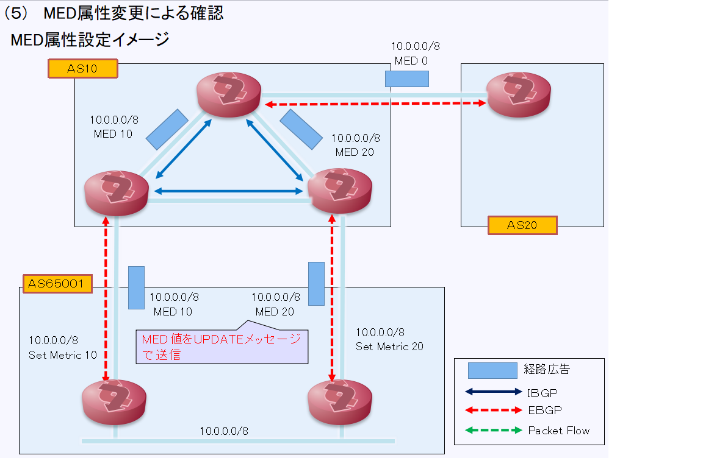
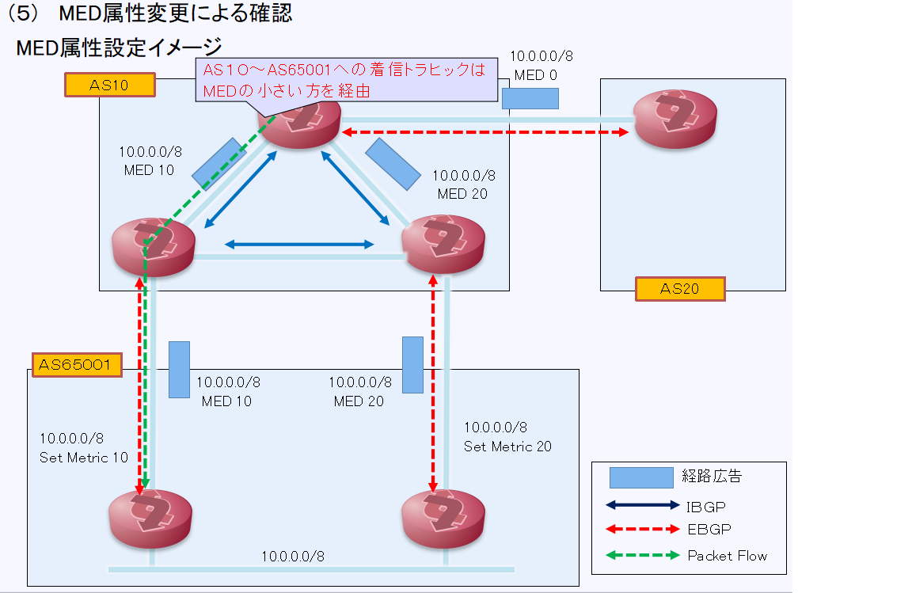
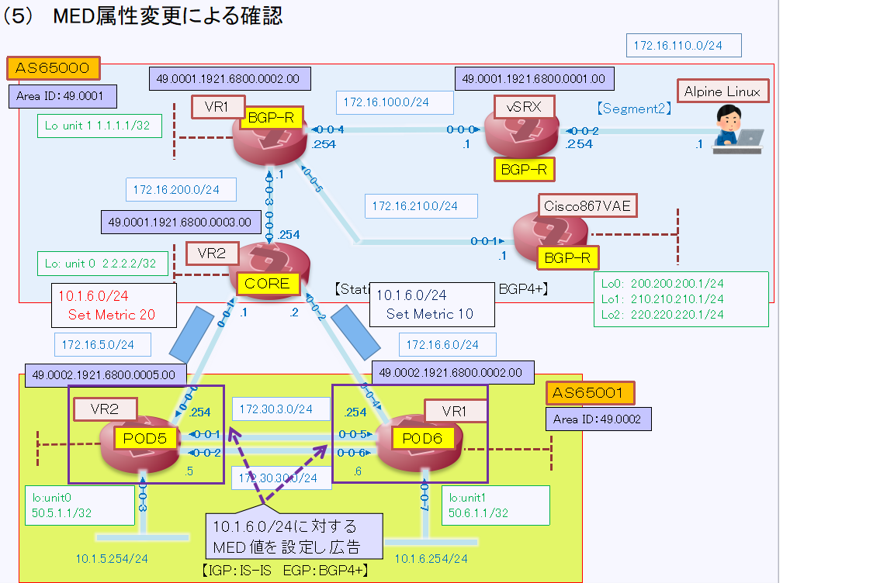
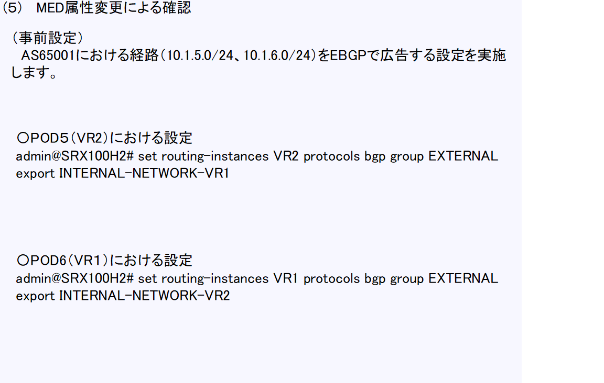
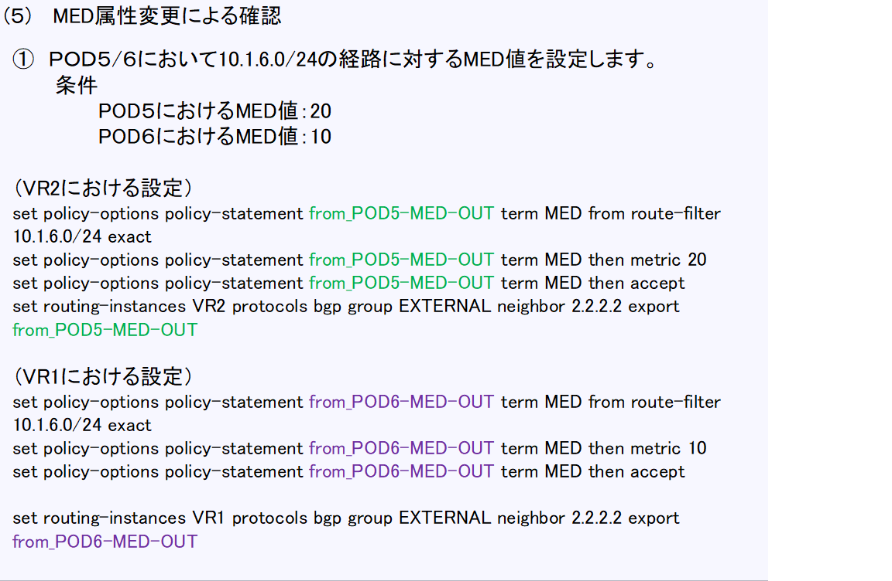
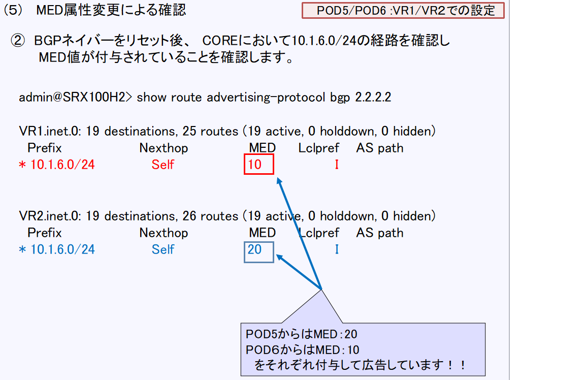
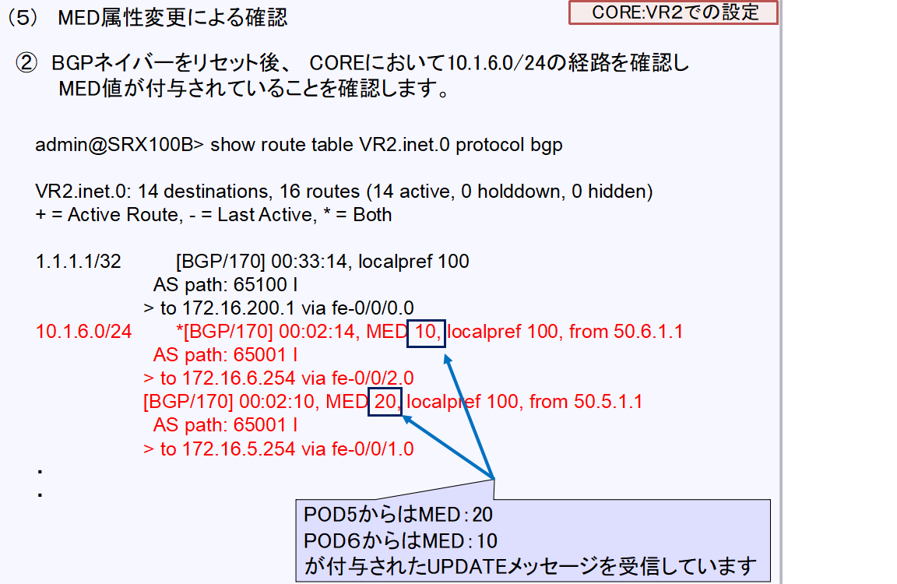
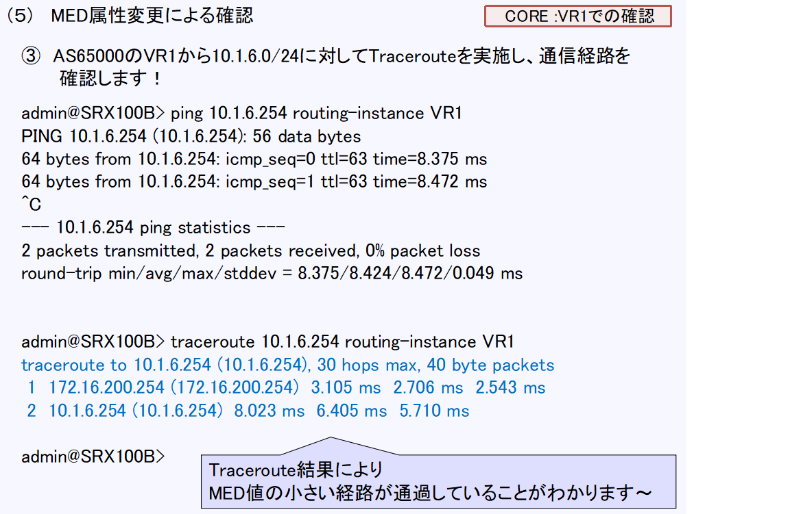

[目次に戻る](./Junos-BGP-exercises.md)  

# MED属性変更による確認
## MED属性とは？？
MED（ タイプコード 4：Optional non-transitive ）とは？？

MEDアトリビュートは、隣接するASのBGPルータに対して、自身のAS内に 
存在するネットワーク宛てのトラフィックの着信先を示すアトリビュートです 

### MED属性の特徴
MED値は隣接するASには伝送されて、そのAS内ではその値が維持されますが、 
次のASに伝送されることはありません 

MED値はデフォルトで 0 でありその値が小さいルートを優先します 
MEDはメトリックとも呼ばれます 

### MED属性設定イメージ
　
　次のスライドで動作を説明します
   
  

  
  
### MED属性設定変更の設定と確認
  （実施手順） 
  【事前確認】 
    AS65001における経路（10.1.5.0/24、10.1.6.0/24）をEBGPで広告する設定を実施します 
　【設定変更】 
 　〇 POD5/6において10.1.6.0/24の経路に対するMED値を設定します 
　　　(条件) 
　　　　POD5におけるMED値：20 
　　　　POD6におけるMED値：10 
   〇 BGPネイバーをリセット後、　COREにおいて10.1.6.0/24の経路を確認し、MED値が付与されていることを確認します 
　 〇 AS65000のVR1から10.1.6.0/24に対してTracerouteを実施し、通信経路を確認します！

  
  
  
  
  
  
  
  
 
