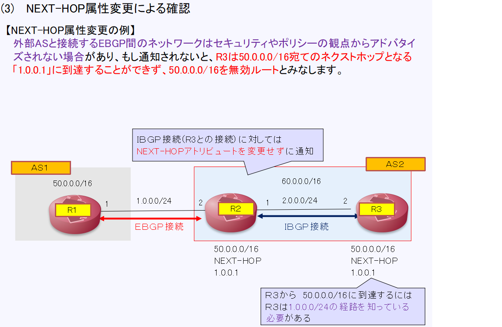
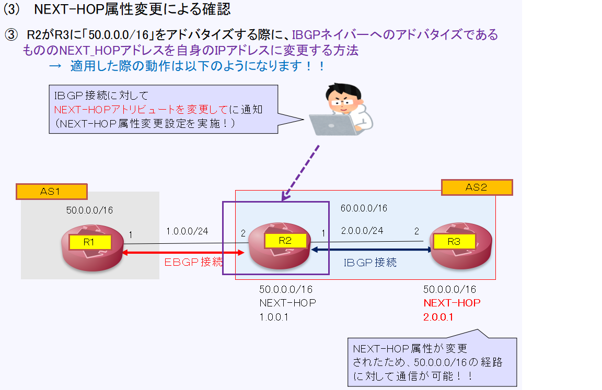

[目次に戻る](./Junos-BGP-exercises.md)  

# NEXT-HOP属性変更による確認
## NEXT-HOP属性とは？？
文字通り、宛先ネットワークへのネクストホップのIPアドレスを示すアトリビュートです 

### IGPとの考え方の違い 
 ASに到達するためのIPアドレス　→　ネクストホップ 
### EBGPピアとIBGPピアにそれぞれアドバタイズする際の動作の違い。
　EBGPピアに対して経路を広告する場合 
  　　→　NEXT_HOPアトリビュートを自分のIPアドレスにして送信 
　IBGPピアに対して経路を広告する場合 
　　　→　NEXT_HOPアトリビュートを変更せずにルートを送信 
　
　次のスライドで動作を説明します
   
  
  図に示す通り、AS1とAS2がEBGPで接続されています 
  　AS１からEBGPで経路情報を受け取ったAS2のR2はAS2のR3に対してIBGPで経路を広告しますが 
  　R2の動作は以下になります 
  　 →　R1から受け取った経路情報をR3（IBGP接続）への広報する際ははBGPのNEXT-HOP属性を変更せずに通知 
  　
 　　R3はR2経由で受け取った50.0.0.0/16を学習しますが、R3から50.0.0.0/16へ到達するためには 
 　　1.0.0.0/24の経路を知っておく必要があります。。 

   以下の方法で解決が可能ですが、
     
   
   (3)のNEXT-HOP属性を変更することにより疎通が可能です！ 
  　 

　　(3)のNEXT-HOP属性を変更した場合のイメージを下記に示します。 
  　  
  

  
  
 

