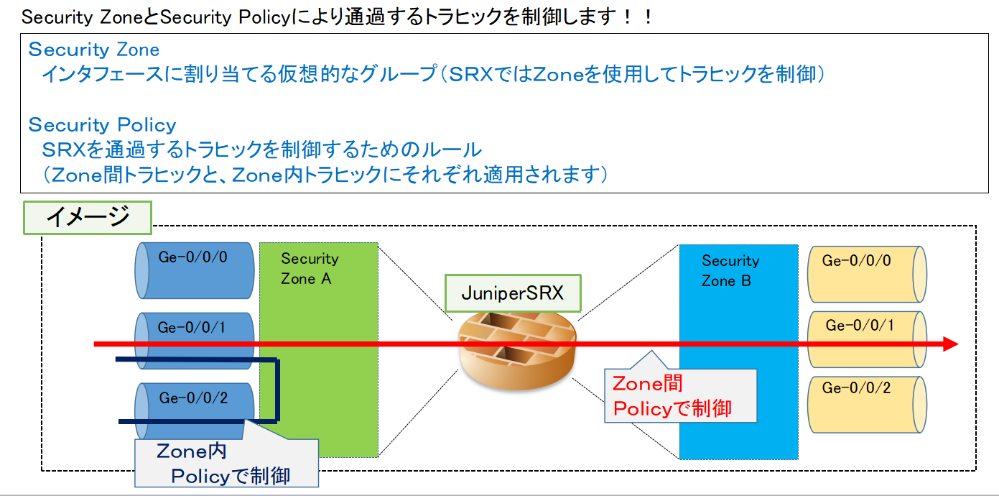
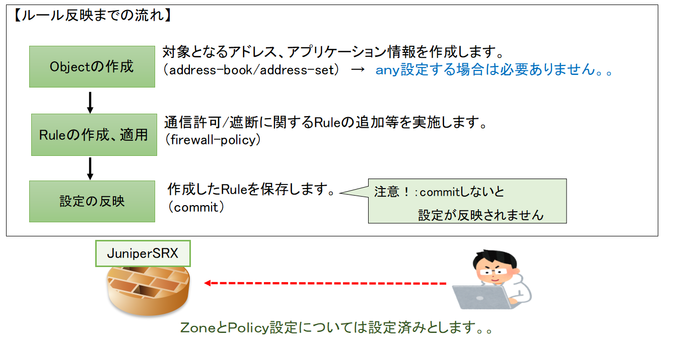
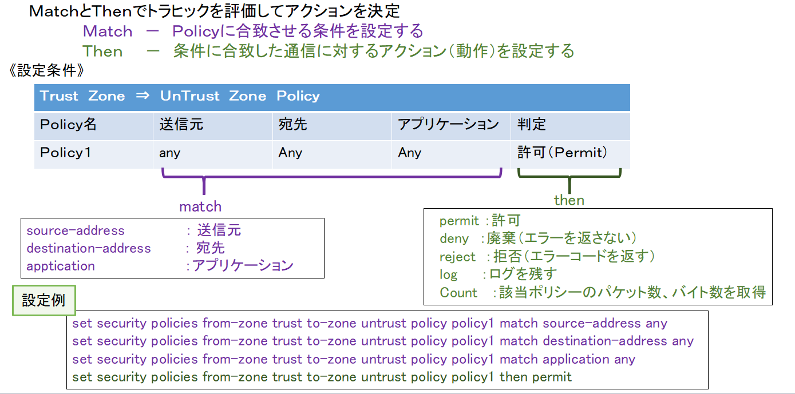
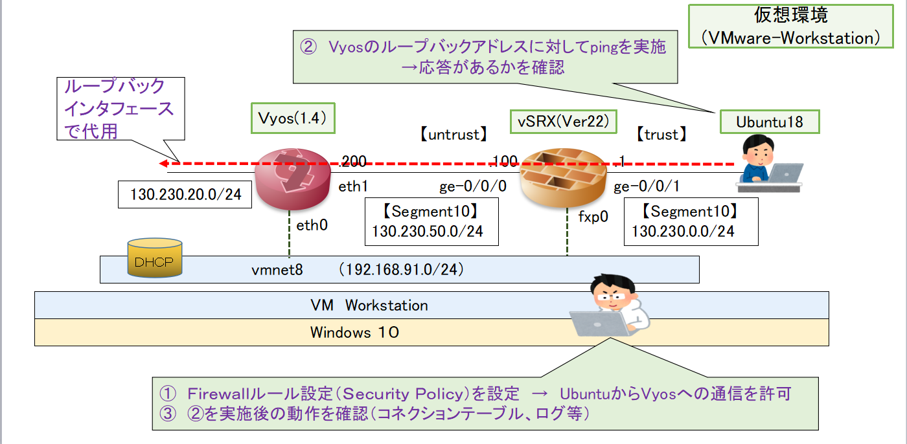

# JuniperSRXにおけるFirewallルール設定について　　

[元に戻る](./JunosSRX-Firewall-Basic.md)  

## Firewallルールの概要
JuniperSRXにおいてはSecurity ZoneとSecurity Policyにより通過するトラヒックを制御します！  
【Security Zone】 
　インタフェースに割り当てる仮想的なグループ（SRXではZoneを使用）  
【Security Policy】 
　SRXを通過するトラヒックを制御するためのルール 

 **JunosにおけるZoneとSecurity Policyのイメージ** 
  
   
## Firewallルール反映までの流れ
〇事前にZoneとInterfaceを設定した上で以下の流れで実施します  
　１　Objectの作成  
 　　対象となるアドレス、アプリケーション情報を作成します  
   　　（address-book/addree-setで作成）　→　すべてを選択（any)する場合は必要ありません  
　２　ルールの作成、適用  
 　　通信許可/拒否に関するルール等の追加等を実施します  
   　　（security-policy) 　
  ３　設定の反映 
  　作成したルールを保存します(commit) 
    *注意！： commitしないとSRXに設定情報が反映されません！！ 

   **JunosにおけるFirewallルール反映までの流れ** 
  
  
### 1 　objectの作成
　ルール適用時の対象サブネット（ホスト）等を指定する際に使用  
(address-bookを複数組み合わせて使用する場合にはaddress-setを使用） 

《設定条件の例》 
　異なるIPサブネットを複数指定してFirewalポリシーに適用したい。 
 ADDRESS BOOKの定義 　
 　1.1.1.1/32　　  ⇒　address-book:AAA　として設定 　
 　172.16.0.0/16　 ⇒　address-book:BBB  として設定 　　
 　192.168.1.0/24　⇒　address-book:CCC　として設定 
 ADDRESS SETの定義 　　
 　　Address-set:BCSET　⇒　address-book:BBB及びCCCを組み合わせ 
   
《設定例》 
address-bookを定義 
  #set security address-book global address AAA 1.1.1.1/32 
  #set security address-book global address BBB 172.16.0.0/16  
  #set security address-book global address CCC 192.168.1.0/24 
  #set security address-book global address-set BCSET address BBB  
  #set security address-book global address-set BCSET address CCC 

address-bookに対して以下のようにaddress-setを適用 
  #set security policies from-zone A to-zone B policy policy1 match source-address AAA  
  #set security policies from-zone A to-zone B policy policy1 match destination-address BCSET 

(参考） 
address-book、address-setの適用については以下の２つの方法があります。 

1　装置全体で適用する場合 
　#set security address-book global address AAA 1.1.1.1/32 
　#set security address-book global address BBB 172.16.0.0/16  
　#set security address-book global address CCC 192.168.1.0/24 

2 個別のSecurity zoneで適用する場合 
　#set security  zones security-zones untrust  address-book address AAA 1.1.1.1/32 
　#set security  zones security-zones untrust  address-book address BBB  172.16.0.0/16 
　#set security  zones security-zones untrust  address-book address CCC 192.168.1.0/24 

 
### 2　ルールの作成、適用
**JunosにおけるFirewallルール（SecurityPolicy）の記述方法** 
 
#### Firewallルールにおけるinsertコマンドについて
一般的にFirewallにおけるルールは先頭に記述したFirewallルールが優先されます。 
Juniper SRXも例外ではありません。。 

SRXにおいてFirewallルールを入れ替える場合は　"insert”コマンドを使用します！ 

（設定例） 
新規に作成したFirewallルール（ポリシー）”TRUST_UNTRUST_POLICY-0001”を"ALL_DENY"の前に入れ替えます 

【新規に適用したいルールを設定します】 
 #set security address-book global address UNTRUST_ADD-0001 XXX.XXX.XXX.XXX/XX 
 #set security address-book global address-set UNTRUST_ADD_SET-0001 address UNTRUST_ADD-0001 
 #set security policies from-zone TRUST to-zone UNTRUST policy TRUST_UNTRUST_POLICY-0001 match 
source-address any 
 #set security policies from-zone TRUST to-zone UNTRUST policy TRUST_UNTRUST_POLICY-0001  
match destination-address UNTRUST_ADD_SET-0001 
 #set security policies from-zone TRUST to-zone UNTRUST policy TRUST_UNTRUST_POLICY-0001
match application any 
 #set security policies from-zone TRUST to-zone UNTRUST policy TRUST_UNTRUST_POLICY-0001 then permit 
 
【現行のルールの前に設定したルールを追加します】 
#insert security policies from-zone TRUST to-zone UNTRUST policy TRUST_UNTRUST_POLICY-0001 before 
policy ALL_DENY 

### 3　設定の反映
commitコマンドにより設定を反映させます 
commit checkコマンドによりcommitエラーがないか確認するのもよいでしょう 

### 3　JuniperSRXでステートフルインスペクション形Firewallの動作を確認してみましょう！
**JunosにおけるZoneとSecurity Policyのイメージ** 
  

### 4　JuniperSRXにおけるFirewallルール設定の例
　ここでは以下のシーンにおけるFirewallルール設定例について紹介します 

(1) 定義済みアプリケーションを指定してルールを適用する場合（その１、その２） 
　　＊Well-knonwポートを使用するアプリケーション（HTTPなど）に適用する場合 

(2) 新たなアプリケーションポート番号を指定し、ルールを適用する場合 
　　＊独自アプリケーションなど普段使用しないポート番号に適用する場合 

(3) 指定すべきアドレス範囲が点在している場合 
　　アドレスブックで指定したいアドレス範囲が点在している。。際に適用する場合 

#### (1) 定義済みアプリケーションを指定してルールを適用する場合(その１、その２）
　【例：HTTP通信のみを許可するルールを作成したい！】 
 　　（設定例） 
   #set security policies from-zone trust to-zone untrust policy HTTP-permit match source-address any 
   #set security policies from-zone trust to-zone untrust policy HTTP-permit match destination-address any 
   #set security policies from-zone trust to-zone untrust policy HTTP-permit match application junos-http 
   #set security policies from-zone trust to-zone untrust policy HTTP-permit then permit 
   #set security policies from-zone untrust to-zone trust policy a l-permit match source-address any 
   #set security policies from-zone untrust to-zone trust policy a l-permit match destination-address any 
   #set security policies from-zone untrust to-zone trust policy a l-permit match application any 
   #set security policies from-zone trust to-zone untrust policy a l-permit then permit 
   #Set security policies default-polices deny-all 　　　　　　　　　　　　　　　　　　　　　　
                                     /　デフォルトポリシー（廃棄） 　　
   　
#### (2) 新たなアプリケーションポート番号を指定し、ルールを適用する場合
 【例１：複数のアプリケーションをまとめて指定したい！】 　
    （設定例） 
application-setを使用して複数のサーバ（サービス）を選択する 
   #set applications application-set MANAGE-SET application junos-ssh 
   #set applications application-set MANAGE-SET application junos-telnet 
   #set applications application-set MANAGE-SET application junos-telnet 
設定したapplication-setを使用してFirewallルールを作成する 
   #set security policies from-zone trust to-zone untrust policy Server-permit match source-address any 
   #set security policies from-zone trust to-zone untrust policy Server-permit match destination-address any 
   #set security policies from-zone trust to-zone untrust policy Server-permit match application MANAGE-SET 
   #set security policies from-zone trust to-zone untrust policy Server-permit then permit 
   #set security policies from-zone untrust to-zone trust policy a l-permit match source-address any 
   #set security policies from-zone untrust to-zone trust policy a l-permit match destination-address any 
   #set security policies from-zone untrust to-zone trust policy a l-permit match application any 
   #set security policies from-zone trust to-zone untrust policy a l-rejecｔ then permit 
   #set security policies default-polices deny-all 　　　　　　　　　　　　　　　　　　　　　　
                               /　デフォルトポリシー（廃棄） 
                               
【例2：通常使用しないポート番号（Wel-Knownポート以外）を指定したい！】 
（設定例） 
　　宛先ポートTCP/23000を新たなアプリケーションとして定義（定義名：untrust-server) 
  #set applications application untrust-Server protocols tcp source-port 1-65535 destination-port 23000 
　　新たなアプリケーションを使用してFirewallルールを作成 
  #set security policies from-zone trust to-zone untrust policy Server-permit match source-address any 
  #set security policies from-zone trust to-zone untrust policy Server-permit match destination-address any 
  #set security policies from-zone trust to-zone untrust policy Server-permit match application untrust-Server 
  #Set security policies from-zone trust to-zone untrust policy Server-permit then permit 
  #set security policies from-zone untrust to-zone trust policy a l-permit match source-address any 
  #set security policies from-zone untrust to-zone trust policy a l-permit match destination-address any 
  #set security policies from-zone untrust to-zone trust policy a l-permit match application any 
  #Set security policies from-zone trust to-zone untrust policy a l-permit then permit 
  #Set security policies default-polices deny-all 
                             /　デフォルトポリシー（廃棄） 

#### (3) 指定すべきアドレス範囲が点在している場合
（設定例） 
点在しているアドレスをrange-addressでそれぞれ定義し、address-setにまとめる 
  #set security address-book global address Attaker-1 range-address 130.135.110.101 to 130.135.110.110 
  #set security address-book global address Attaker-2 range-address 130.190.100.100 to 130.190.100.103 
  #set security address-book global address-set Attaker-segment address Attaker-1 
  #set security address-book global address-set Attaker-segment address Attaker-2 
address-setにまとめたものを使用してFirewallルールを作成 
  #set security policies from-zone untrust to-zone trust policy Attaker-deny match source-address Attaker-segment 
  #set security policies from-zone untrust to-zone trust policy Attaker-deny match destination-address any 
  #set security policies from-zone untrust to-zone trust policy Attaker-deny match application any 
  #set security policies from-zone untrust to-zone trust policy Attaker-deny then deny 
  #set security policies default-polices permit-all　 　　　　　　　　　　　　　　　　　　　　　
 　　　　　　　　　　　　　　　/　デフォルトポリシー（通過） 
### 4　通信中のコネクション（セッション）に対する新規新規Firewallルールを適用
通信中のコネクション（セッション）に対して新たにルールを適用して切断したい！ 
　　　　　　　　　　　　　　　→　　　　ルールを適用するには各種条件があります！！ 
#### JunosSRXにおけるPolicy-rematchフラグの設定について
Policy-rematchフラグが有効の場合におけるJunos OSが実行するアクションは以下の通りです 
　　　　-ポリシーを挿入する：　影響なし 
　　　　-ポリシーのActionフィールドをpermitからdenyまたはrejectのいずれかに変更する 
　　　　　　　　　　　　　　　　　　：　既存のセッションがすべてドロップする 
　　　　　　　　　　　　　　　　　　　　（すべてのセッションがドロップするためお勧めしません） 
　　　　-送信元アドレス、宛先アドレス、アプリケーションフィールドの一部の組み合わせを変更する 
　　　　　　　　　　　　　　　　　　：  Junos OSがポリシールックアップを再評価する・・ 
　　　　　　　　　　　　　　　　　　　　（こちらの方がベスト！） 
〇参考資料 
  SRXシリーズ スタディガイド　－パート１　第３章　セキュリティポリシー　を参照 
                    https://www.juniper.net/assets/jp/jp/local/pdf/others/JNCIS-SEC-1_.pdf 
