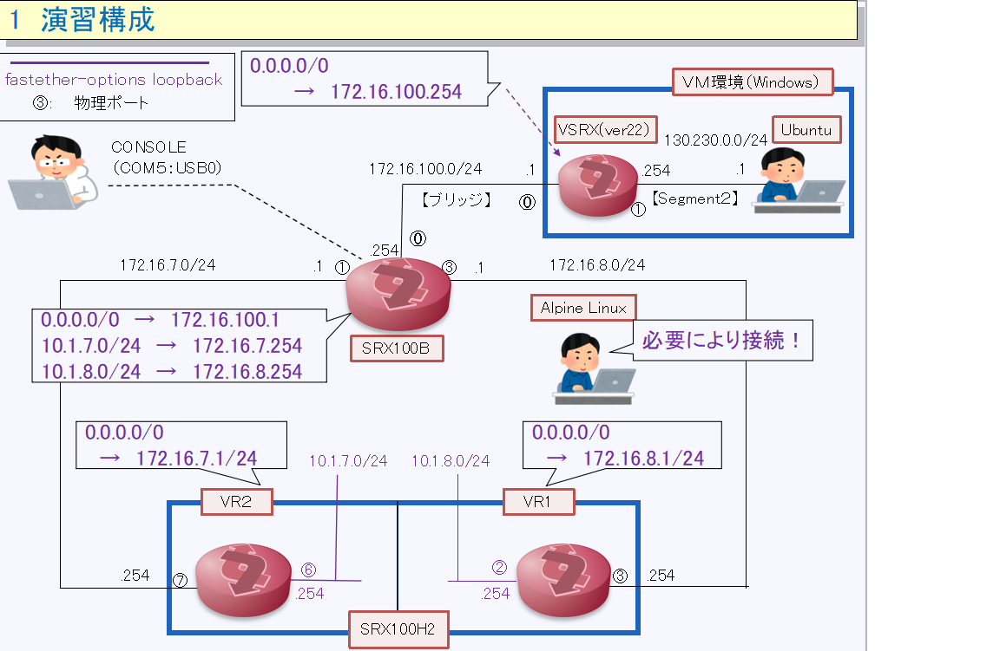

[始めに戻る](./Junos-JSEC-exercises.md)  

今回の演習で使用する演習環境は以下のようになっています！！ 

 

VM環境に構成されたUbuntuとVSRXと接続されたSRX100が2方向で対向のSRX100に接続されています 
対向のSRXはバーチャルルータ(VR）を使用して１台のSRX100上に２台のSRXを構成しています 
対向のSRX側はFast-etherオプション設定により端末が接続されていなくてもLinkUPしています 
必要によりAlpineLinuxを接続できるようにしています 

SRX100における事前設定（抜粋） 

【ゾーンの設定】 
〇 Zone：untrust 
set security zones security-zone untrust screen untrust-screen 
set security zones security-zone untrust host-inbound-traffic system-services all 
set security zones security-zone untrust host-inbound-traffic protocols all 
set security zones security-zone untrust interfaces fe-0/0/1.0 
set security zones security-zone untrust interfaces fe-0/0/3.0 

〇　Zone：Trust 
set security zones security-zone trust host-inbound-traffic system-services all 
set security zones security-zone trust host-inbound-traffic protocols all 
set security zones security-zone trust interfaces fe-0/0/0.0 

【セキュリティーポリシーの設定】 
set security policies from-zone trust to-zone untrust policy trust-to-untrust match source-address any 
set security policies from-zone trust to-zone untrust policy trust-to-untrust match destination-address any 
set security policies from-zone trust to-zone untrust policy trust-to-untrust match application any 
set security policies from-zone trust to-zone untrust policy trust-to-untrust then permit 
set security policies from-zone untrust to-zone trust policy untrust-to-trust match source-address any 
set security policies from-zone untrust to-zone trust policy untrust-to-trust match destination-address any 
set security policies from-zone untrust to-zone trust policy untrust-to-trust match application any 
set security policies from-zone untrust to-zone trust policy untrust-to-trust then permit 
set security policies default-policy deny-all 

【経路情報の設定】 
set routing-options static route 0.0.0.0/0 next-hop 172.16.100.1 
set routing-options static route 10.1.7.0/24 next-hop 172.16.7.254 
set routing-options static route 10.1.8.0/24 next-hop 172.16.8.254 

