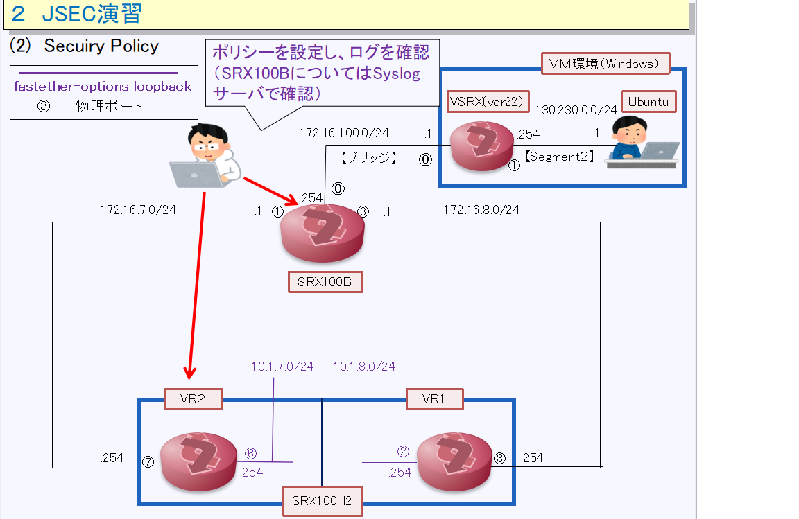
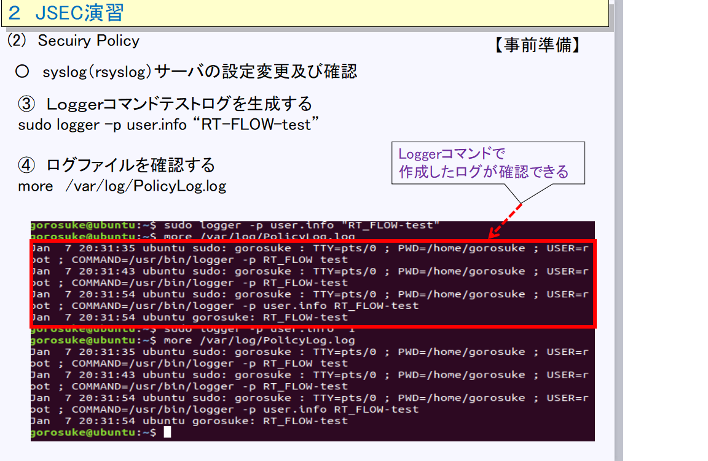

[始めに戻る](./Junos-JSEC-exercises.md)  

 ### Security-policy設定の構成 

 

今回はSRX100(VR設定なし）とSRX100(VR設定あり：VR2）のみSecuirty-policy及びSyslog設定を実施します 

【事前準備】 
１　Linux（Ubuntu）において以下の設定及び確認を実施します
　(1) Python2を使用して簡易Webサーバーを起動します 
　　　

　(2) Syslogサーバーを設定及び起動します 
 　　〇 設定ファイル　”/etc/rsyslog.conf”に以下の内容を編集/追加 
　　　
   
     〇 rsyslogサーバーの起動状態の確認 
   
     
  (3) Loggerコマンドを使用して、Syslogサーバにログが残ることを確認します 
  　 

２　SRXにおけるSecuirty-policy設定及びSyslog設定 
　(1)　SRX100H2(VR設定あり）での設定及び確認 
　　　Security Policyを設定し、SRXの内部ストレージにログを格納します 
　【設定手順】 
    
　　　（細部は別スライド） 　
　　　
　〇　通信を発生させSRX100（VR2）の内部ログに残るかを確認します 
【設定結果】 
　　ア）Policyで使用するAddressbookを作成します 
  　　set security zones security-zone untrust-VR2 address-book address Server-net 130.230.0.0/24 
　　　set security zones security-zone trust-VR2 address-book address Client-Net 10.1.7.0/24 

    イ）
 
 　　(2) SRX100(VR設定なし）での設定及び確認 
　　　Security Policyを設定し、Syslogサーバにログを転送します 
　【設定】
　【設定結果】 
  　 （Security-Policy設定) 
     admin@SRX100> show configuration security policies | display set 
     set security policies from-zone trust to-zone untrust policy trust-to-untrust match source-address any 
     set security policies from-zone trust to-zone untrust policy trust-to-untrust match destination-address any 
     set security policies from-zone trust to-zone untrust policy trust-to-untrust match application any 
     set security policies from-zone trust to-zone untrust policy trust-to-untrust then permit 
     set security policies from-zone untrust to-zone trust policy untrust-to-trust match source-address any 
     set security policies from-zone untrust to-zone trust policy untrust-to-trust match destination-address any 
     set security policies from-zone untrust to-zone trust policy untrust-to-trust match application any 
     set security policies from-zone untrust to-zone trust policy untrust-to-trust then permit 
     set security policies default-policy deny-all 
    
　　（Syslog設定） 
       admin@SRX100> show configuration system syslog | display set 
                     set system syslog host 130.230.0.1 user info 
                     set system syslog host 130.230.0.1 source-address 172.16.100.254 
                     set system syslog file Policylog user info 
                     set system syslog file Policylog explicit-priority 
    

    
   

 

